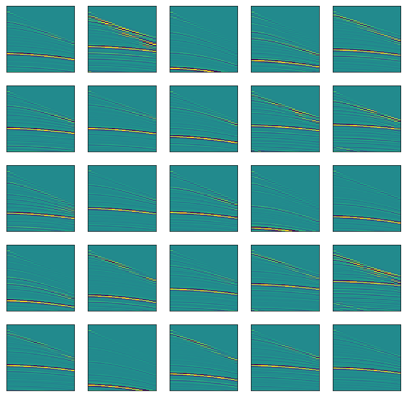
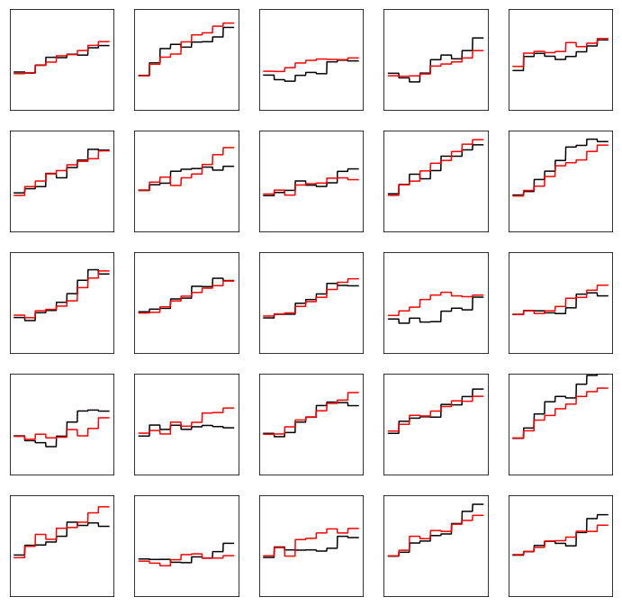

[](https://opensource.org/licenses/MIT) 
[](https://lgtm.com/projects/g/LukasMosser/SNIST/context:python) [](https://colab.research.google.com/github/LukasMosser/SNIST/benchmarks/SNIST_Benchmark_Roeth_and_Tarantola.ipynb)

# Seismic-NIST
---
```Seismic-NIST``` is a dataset of acoustic [seismic]() waveforms and their underlying velocity profiles. The dataset is inspired by the work of [Roeth and Tarantola 1994]() where the authors tried to perform [seismic inversion]() from raw acoustic waveforms at various levels of noise. Here we provide a reference dataset of such waveforms. The machine learning task to be solved is a regression problem of predicting synthetic [p-Wave velocity]() profiles from given acoustic waveforms. The data can be generated completly from scratch using ```[torch]``` and libraries from the [```devito```]() project.

## What the data looks like
---
The dataset consists of 750 waveforms generated from 9-layer earth models of acoustic p-wave velocities.  
The training set consists of 600 waveforms and the test sets consist of 150 waveforms.  
There are three test sets - SNIST-0, SNIST-1 and SNIST-2.  
The number corresponds to the level of noise added to the test set i.e. SNIST-0 has no noise added, SNIST-1 adds 1 sigma of noise, and SNIST-2 has 2 sigma of noise added. The noise is Gaussian uncorrelated noise.  
Each waveform consists of 20 [traces]() according to 20 [offsets] sampled at 8 ms time intervals. [p-Wave velocities]() are capped at 4000 [m/s]. 
Here's what the waveform amplitudes and some of the velocity profiles (ground truth - black) look like.




## Why Seismic-NIST was created
---
The dataset was largely inspired by discussion on the [software-underground]() slack channel and by Agile Geoscience's [blog post]() on benchmark studies in the machine learning - geoscience domain.    
While the realism and usefulness in terms of real seismic applications is limited, this benchmark may serve as a reference on what a realistic benchmark should include. Hence, this benchmark is very much a platform or sandbox as not (m)any reference benchmarks exist in the seismic deep-learning domain. It is up to the community to shape what we want out of such a reference benchmark and I hope to provide here a starting point for such a discussion.  
If you would like to contribute or would like to raise an [issue]() please do so and join the discussion on the [slack-channel]().

## Get the Data
---
The data comes prepackaged as ```.npy``` files. Which you can either download manually or use the existing ```torch.dataset``` implementation found in ```utils/snist```.

| File            | Examples | Size | Download (NumPy format)      |
|-----------|--------------|------------|------------------|
| Training Amplitudes | 600             | 13 MB | [train_amplitudes.npy](https://raw.githubusercontent.com/LukasMosser/SNIST/master/data/train/train_amplitudes.npy) |
| Training Velocities | 600             | 21 KB | [train_velocities.npy](https://raw.githubusercontent.com/LukasMosser/SNIST/master/data/train/train_velocities.npy)  |
| Testing Amplitudes 0 (no noise - SNIST-0)  | 150             | 3 MB |[test_amplitudes.npy](https://raw.githubusercontent.com/LukasMosser/SNIST/master/data/test/test_amplitudes.npy)  |
| Testing Amplitudes 1 (1 sigma noise - SNIST-1)  | 150             | 3 MB |[test_amplitudes_noise_1.npy](https://raw.githubusercontent.com/LukasMosser/SNIST/master/data/test/test_amplitudes_noise_1.npy)  |
| Testing Amplitudes 2 (2 sigma noise - SNIST-2)  | 150             | 3 MB |[test_amplitudes_noise_2.npy](https://raw.githubusercontent.com/LukasMosser/SNIST/master/data/test/test_amplitudes_noise_2.npy)  |
| Testing Velocities  | 150            | 5 KB | [test_velocities.npy](https://raw.githubusercontent.com/LukasMosser/SNIST/master/data/test/test_velocities.npy) |

### Pytorch Datasets

The following is an example on how to use the provided dataset in ```torch```.
All the data will automatically be downloaded - in this case - from the directory and is ready for training.  
You can try it out on [](https://colab.research.google.com/github/LukasMosser/SNIST/benchmarks/SNIST_Benchmark_Roeth_and_Tarantola.ipynb).  

```python
from utils.snist import SNIST

snist_train = SNIST('./', train=True, download=True)
snist_0_test = SNIST('./', train=False, download=True, noise=0)
snist_1_test = SNIST('./', train=False, download=True, noise=1)
snist_2_test = SNIST('./', train=False, download=True, noise=2)
```

## Benchmarks and Results
---
|Model                            | SNIST-0 | SNIST-1 | SNIST-2 | Credit | Link 
|---------------------------------|---------|---------|---------|--------|------
|[1-Hidden Layer Benchmark](benchmarks/SNIST-Benchmark-Roeth-and-Tarantola.ipynb)     | 242.42 [m\s] | 287.98 [m\s] | 428.59 [m\s] | [@porestar](twitter.com/porestar)|[](https://colab.research.google.com/github/LukasMosser/SNIST/benchmarks/SNIST_Benchmark_Roeth_and_Tarantola.ipynb)

## Generating the data
---
The data can be reproduced by running ```make build``` in the ```data_generation```
directory.  
This will run three scripts:
- ```generate_velocities.py```: creates the velocity models based on the paper by Roeth and Tarantola
- ```generate_amplitudes.sh```: runs a docker container of [devito](https://github.com/opesci/devito) and runs the forward model on the created velocities
- ```generate_noisy_test_set.py```: creates the noisy SNIST versions SNIST-1 and SNIST-2
